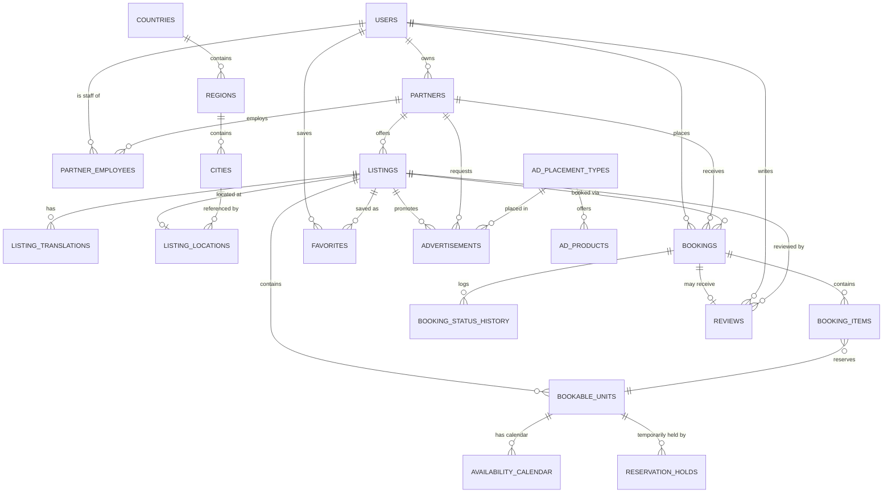
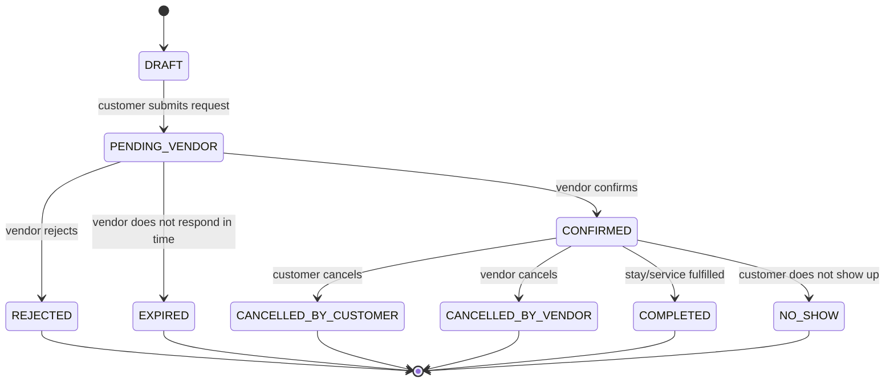
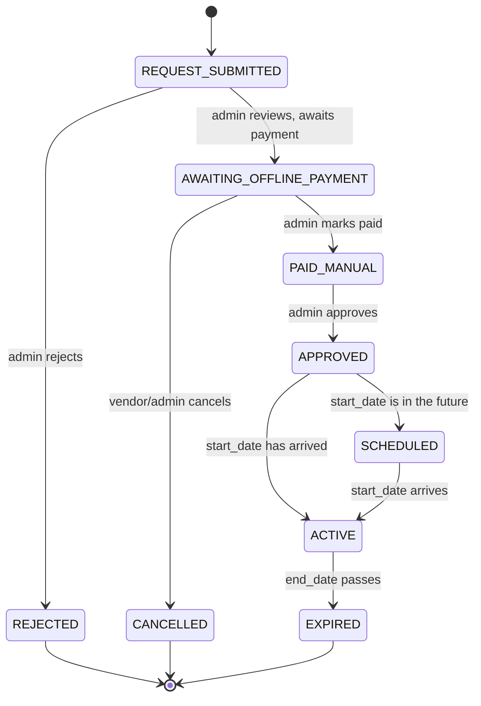

# Sprint 5 — Backend Foundation and Database Core

This document records what Sprint 5 built, the architecture decisions made
while reconciling the Sprint 5 brief against the already-governed
`BACKEND_ARCHITECTURE.md` / `DATABASE_ARCHITECTURE.docx` / `BOOKING_ENGINE_ARCHITECTURE.md`
/ `API_SPECIFICATION.md`, and the conventions every future sprint's schema
work should follow. It is an **amendment document**, not a replacement —
`DATABASE_ARCHITECTURE.docx` remains the source of truth for everything it
already specifies; this file records where Sprint 5 extends or narrows it.

## 1. Architecture Decisions

### 1.1 No Prisma — raw `mysql2` + versioned SQL migrations

The Sprint 5 brief asked for Prisma. `SPRINT_0_IMPLEMENTATION_PLAN.md`
states the MySQL driver is `mysql2`, and `BACKEND_ARCHITECTURE.md` Ch.7
describes a hand-written Repository **port + concrete-implementation**
pattern around it (`apps/api/src/infrastructure/database/mysqlPool.js`
already existed, pre-Sprint-5, as that pool). Prisma appears nowhere in
the repository's history or docs. Per `CLAUDE.md`'s "do not replace the
existing stack unless it is demonstrably broken," Sprint 5 kept `mysql2`
and satisfied "versioned migrations" with a small custom runner
(`src/infrastructure/database/migrate.js`) applying paired
`NNNN_name.up.sql` / `NNNN_name.down.sql` files, tracked in a
`schema_migrations` table. Future Repository implementations
(`src/modules/*/repositories/`) query through the shared pool exactly as
`BACKEND_ARCHITECTURE.md` §7 already specifies — nothing about that
pattern changes.

### 1.2 "Partner," not "Vendor"

Every existing module folder (`partners/`, `organizations/`,
`employees/`), role name, table, and doc already uses **"Partner."**
"Vendor" appeared nowhere in the repository. Sprint 5's Vendor language
maps onto it: `VENDOR_OWNER`/`VENDOR_STAFF` → partner-scoped roles in
`partner_employee_roles` (§4 below), "Vendor Foundation" → `partners` /
`partner_employees`.

### 1.3 Booking status machine — MVP amendment

`BOOKING_ENGINE_ARCHITECTURE.md` already defines an 11-status,
payment-gateway-dependent machine (`Draft → Pending → Reserved →
Confirmed → Checked In → Checked Out → Completed`, plus `Cancelled`/
`Expired`/`Refunded`/`Chargeback`) that assumes online card authorization
at every hold. Sprint 5's business requirement is explicit: **v1 ships
with no online payments** — booking request → vendor confirms/rejects →
pay at property → cancel/complete. `booking_statuses` and
`payment_statuses` are lookup tables (never native `ENUM`s), so this is a
**data amendment, not a schema fork**: they are seeded with Sprint 5's
9/4-value MVP vocabulary (§5.2 below) instead of the documented 11-status
machine. Reintroducing the full gateway-integrated machine later — when
online payment ships — is adding rows and wiring a `payments` module, not
migrating existing data.

### 1.4 Scope boundary

Sprint 5 implements only what its own sections 1–14 ask for: Identity,
Partners, Location/Taxonomy, the shared Listing foundation, Media,
Booking (no payments), Reviews/Favorites, Advertising, SEO, an Analytics
event *contract*, and Audit/Activity logging. `DATABASE_ARCHITECTURE.md`'s
Pricing/Tax/Commission, Coupons, Messaging, Notifications, Payments,
Wallet, Payouts, and CMS domains are **not built** — Sprint 5 never asks
for them, and building them now would be undocumented scope creep. No
controllers/services/routes were added for any feature module — every
`src/modules/*/` folder remains scaffold-only, per each module's own
README and `app.js`'s existing "Module routers are mounted... in future
sprints" comment. This sprint is schema + shared infrastructure + seed +
docs + tests only.

## 2. Database Conventions

- `snake_case`, plural table names, `BIGINT UNSIGNED` surrogate PK on
  every table (`DATABASE_ARCHITECTURE.md` §2).
- **No native `ENUM`.** Every fixed vocabulary (statuses, types, roles) is
  a lookup table with a unique `code` — a new value is a data insert, not
  a migration. One exception: `bookings.payment_method` is a plain
  `VARCHAR(20)` fixed at `'offline'` this release (a lookup table for a
  single current value would itself be unnecessary schema).
- **Timezone-safe dates**: every timestamp is `DATETIME(3)` (never
  `TIMESTAMP`, which MySQL silently converts using session timezone).
  `DATETIME` has no implicit timezone conversion — the application layer
  always writes/reads UTC. Date-only fields (`availability_calendar.date`,
  `bookings` line-item date ranges) use `DATE`.
- **Money**: `DECIMAL(12,2)` columns, always paired with an explicit
  `currency_id` — never a float. `src/core/domain/money.js`'s `Money`
  value object represents amounts as integer minor-units internally so
  application-layer arithmetic never touches floating point;
  `mysql2` returns `DECIMAL` columns as strings specifically so
  `Money.fromDecimalString` can parse them without precision loss.
- **Soft delete**: business tables carry a nullable `deleted_at`; queries
  default to `deleted_at IS NULL` (`src/infrastructure/database/softDelete.js`).
  Reference/lookup tables (languages, currencies, every `*_statuses`/
  `*_types` table) do **not** carry soft-delete or `created_by`/
  `updated_by`/`deleted_by` — they are seeded platform data, not
  user-authored business records.
- **Soft-delete-safe uniqueness**: MySQL has no partial unique index, so
  `users.normalized_email`, `partners.slug`, `listings.slug`, and
  `partner_employees`'s `(partner_id, user_id)` pair each use a `STORED`
  generated column that collapses every soft-deleted row's value to
  `NULL` (which a unique index never treats as a collision) — only
  *active* rows are constrained unique. See `users.active_normalized_email`
  in migration `0002` for the reference implementation of this pattern.
- **Audit trail**: business tables carry `created_by`/`updated_by`/
  `deleted_by` (nullable FKs to `users.id`).
- **Polymorphic entities** (`addresses`, `media`, `favorites` mirror this
  via a direct FK since they're single-target) use an
  `{x}able_type`/`{x}able_id` pair with **no formal FK** — validated at
  the Service layer, matching every polymorphic table `DATABASE_ARCHITECTURE.md`
  already documents (`reviews`, `notifications`, `audit_logs`).
- **Shared lookup reuse**: `moderation_statuses` (`PENDING`/`APPROVED`/
  `REJECTED`/`FLAGGED`) is one table reused via independent FK columns by
  `partners` (verification *and* moderation), `listings`, `media`, and
  `reviews` — not four near-identical lookup tables.
- **Indexing**: every FK is indexed; composite indexes lead with the
  equality-filtered column before a range filter (e.g.
  `idx_bookings_customer_user_id_status_id_created_at`), matching
  `DATABASE_ARCHITECTURE.md` §6.
- **Geo coordinates**: plain `DECIMAL(10,7)` latitude/longitude columns,
  not a `SPATIAL POINT` — radius/"near me" search is explicitly out of
  scope this sprint (Sprint 5 §18); adding a spatial index later is
  additive.
- **Error mapping**: `src/infrastructure/database/errorMapping.js` maps
  `mysql2` driver error codes (`ER_DUP_ENTRY`, `ER_NO_REFERENCED_ROW*`,
  ...) to the existing `AppError` hierarchy — a Repository never lets a
  raw driver error escape.

## 3. Entity Relationship Overview



*(Reference/lookup tables — `*_statuses`, `*_types`, `roles`,
`permissions`, `languages`, `currencies`, `listing_categories`,
`listing_amenities`, `tags` — are omitted above for readability; every
foreign key they participate in is documented in the migration files
themselves, `src/infrastructure/database/migrations/000*.up.sql`.)*

## 4. Role and Permission Strategy

Two independent RBAC layers, matching `DATABASE_ARCHITECTURE.md` §9:

- **Global roles** (`roles` table, migration `0002`): `CUSTOMER`,
  `MODERATOR`, `ADMIN`, `SUPER_ADMIN`, assigned via `role_user`, checked
  via `permission_role` — application code checks a **permission key**
  (`listing.publish`, `booking.confirm`, ...), never a role name directly.
- **Partner-scoped roles** (`partner_employee_roles`, migration `0003`):
  `OWNER`, `MANAGER`, `EDITOR`, `BOOKING_MANAGER`, `ANALYTICS_VIEWER`,
  assigned per `partner_employees` row, scoped to exactly one
  `partner_id` — a partner-employee token is never sufficient on its own
  without also matching the specific partner resource being acted on.

A user can hold a global role **and** be an employee of multiple partner
organizations simultaneously — `partner_employees` is a native N:M table.
`CUSTOMER` deliberately has zero `permission_role` rows: a customer's
access to their own bookings/reviews/favorites is an *ownership* check
(comparing the resource's owning `user_id` to the request principal),
not an RBAC permission — see `docs/BACKEND_ARCHITECTURE.md` §13.

## 5. State Machines

### 5.1 Booking (MVP, no payment gateway)



Payment status is tracked independently on the same `bookings` row:
`NOT_REQUIRED_ON_PLATFORM → PAY_AT_PROPERTY → PAID_OFFLINE
[→ REFUNDED_OFFLINE]`. Every transition writes a `booking_status_history`
row in the same transaction as the status change (`withTransaction`,
`src/infrastructure/database/transaction.js`) — this schema does not yet
enforce *which* transitions are legal (that belongs to the Bookings
module's Service layer, a future sprint); `apps/api/tests/unit/domain/bookingStatusTransitions.test.js`
documents the intended legal-transition set as a pure function today so
that Service layer has a tested reference to implement against.

### 5.2 Advertisement (Featured Listings)



## 6. Migration Workflow

```bash
npm run db:migrate         # apply all pending migrations
npm run db:migrate:down    # revert the most recent migration
npm run db:migrate:status  # list applied/pending; exits 1 if any pending
```

Each domain group is one paired `NNNN_name.up.sql` / `NNNN_name.down.sql`
file under `apps/api/src/infrastructure/database/migrations/`, applied in
numeric order, tracked in `schema_migrations`. **MySQL DDL auto-commits**
(no transactional DDL) — every migration therefore uses
`CREATE TABLE IF NOT EXISTS` so a partially-applied file can be fixed and
safely re-run. Add a new migration by creating the next `NNNN_` pair; never
edit an already-applied migration file — a schema correction is a new,
additive migration (`DATABASE_ARCHITECTURE.md` §15.5's expand-and-contract
rule).

## 7. Seed Workflow

```bash
npm run db:seed   # idempotent — safe to run repeatedly
npm run db:reset  # DEV ONLY: drop + recreate the DB, migrate, then seed
```

`db:reset` refuses to run when `NODE_ENV=production`
(`src/infrastructure/database/reset.js`). Seed modules run in a fixed
order inside one transaction (`src/infrastructure/database/seeds/index.js`):
lookup vocabularies → reference/location data → taxonomy + ad products →
roles/permissions → dev accounts. Every module upserts on a natural key
(`seeds/helpers.js`), so re-running `db:seed` never duplicates data.

### Development credentials

**Not suitable for production — publicly documented on purpose.**

| Role | Email | Password |
|---|---|---|
| Super Admin | `admin@travelhub.dev` | `DevAdmin!2024` |
| Vendor (Partner Owner) | `vendor@travelhub.dev` | `DevVendor!2024` |
| Customer | `customer@travelhub.dev` | `DevCustomer!2024` |

The vendor account owns a seeded sample partner, "Yerevan Boutique
Hospitality" (`slug: yerevan-boutique-hospitality`), pre-approved
(`verification_status`/`moderation_status` = `APPROVED`).

## 8. Environment Variables

New in Sprint 5 (see `apps/api/.env.example` for the full, current list):

| Variable | Purpose | Default |
|---|---|---|
| `DATABASE_NAME_TEST` | Isolated database for `test:integration` — never the same DB as `DATABASE_NAME` | `travelhub_test` |

All other configuration (`DATABASE_*`, `REDIS_URL`, rate-limit tiers, JWT
secrets) predates Sprint 5 and is unchanged.

## 9. Local Setup

```bash
npm install
npm run docker:up          # MySQL 8.4, Redis, Mailpit, Adminer
npm run db:migrate --workspace apps/api
npm run db:seed --workspace apps/api
npm run dev:api
curl http://localhost:4000/health/ready
```

## 10. Testing Strategy

- **Unit** (`apps/api/tests/unit/`, no infrastructure): `Money` value
  object arithmetic and currency guards, pagination cursor encode/decode,
  MySQL error-code mapping, booking/advertisement status-transition
  validators (pure functions), config validation.
- **Integration** (`apps/api/tests/integration/`, real MySQL via
  `DATABASE_NAME_TEST`): migrate-from-empty-database, seed-is-idempotent
  (run twice, assert no duplicate/changed row counts), RBAC relationship
  integrity (role → permission → user joins resolve correctly),
  soft-delete default scoping, unique-constraint enforcement (including
  the soft-delete-safe generated-column pattern), health/readiness
  endpoints (pre-existing, re-verified unaffected by the rate-limit and
  `/api/v1` changes).
- Contract tests (`apps/api/tests/contract/`) remain unpopulated — no
  endpoint contracts exist yet to validate against, unchanged from Sprint 1.

## 11. Deferred Functionality

Explicitly out of scope for Sprint 5 (per its own §18, plus schema
domains `DATABASE_ARCHITECTURE.md` documents that Sprint 5 doesn't touch):

- Category-specific extension tables (`hotels`, `hotel_room_types`,
  `vacation_houses`, `restaurants`, `car_rentals`, `tours`, ...) and their
  availability logic — `bookable_units`/`listings` provide the extension
  points; the tables themselves are future-sprint work.
- Online payment gateway integration, `payments`/`payment_transactions`/
  `refunds`/`invoices`, the full 11-status gateway-dependent booking
  machine (`BOOKING_ENGINE_ARCHITECTURE.md`) — reintroduced when online
  payment ships, as a data/module addition (§1.3 above).
- Pricing/Tax/Commission engine, Coupons, Messaging, Notifications,
  Wallet, Payouts, CMS — not requested by Sprint 5, not built.
- Any controller/service/route code for any feature module — every
  `src/modules/*/` folder remains scaffold-only.
- Public SEO pages, sitemap generation, redirect middleware — the
  database foundation (SEO columns, `listing_slug_history`) exists;
  the pages/middleware consuming it do not.
- Production cloud object storage — `StorageProvider` is an abstraction
  (`src/core/interfaces/StorageProvider.js`) with only a local-disk dev
  implementation (`src/infrastructure/storage/localStorageProvider.js`);
  no upload endpoint exists yet.
- `system_settings`-backed public configuration
  (`GET /settings/public`, `BACKEND_ARCHITECTURE.md` §18) — `config/index.js`
  still sources the hold-duration/rate-limit values from environment
  variables; migrating them to read from a `system_settings` table is
  deferred to the sprint that implements the Settings module.
- Spatial ("near me") search — `listing_locations` stores plain
  lat/lng `DECIMAL` columns rather than a `SPATIAL POINT`/index.
